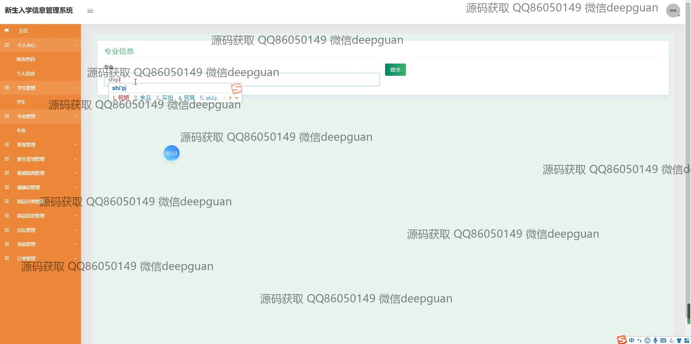

<h1 align="center">新生入学报到管理系统</h1>

## 简介
新生入学报到管理系统：角色分为管理员、用户；功能包括信息录入、报到状态更新、新生管理、缴费管理、订单管理、健康码管理、个人信息编辑和数据统计分析。    --计算机毕业设计源码；毕设源码；java毕业设计源码

## 联系方式

<h3 align="center">获取完整代码与数据库文件 + 微信：deepguan QQ: 86050149 QQ群: 783742310</h3>

<h3 align="center">可帮忙远程部署 包运行成功！提供远程部署、修改代码、设计文档指导、代码讲解等服务！</h3>

## 功能介绍（完整见运行截图）
管理员：提供新生信息录入、报到状态更新、信息查询和统计分析等功能。负责学生管理，包括查看、修改和删除班级信息以及健康码管理。可发布和管理公告信息，并维护论坛帖子。具备权限管理能力，确保数据安全和隐私。

用户：能够查看和编辑个人信息，包括姓名、学号等，并上传头像。进行信息登记、缴费和物流查询。可以浏览公告、论坛信息并发表评论或收藏。通过个人中心管理订单和地址。支持商品信息查询和购买，享受便捷操作体验。

## 运行截图

本代码来源于网络,仅供学习参考使用!

